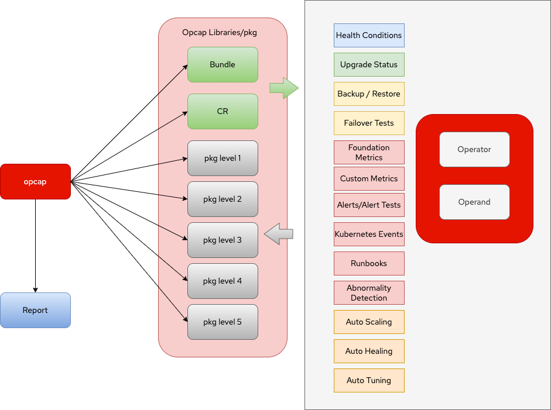

# opcap - Operator Capability Audit Tool

This document's goal is to help engineers understand how we are testing what we call operator levels. Like any other application operators, or more simply kubernetes extensions with dedicated controllers, can be quite complicated to write depending on how complex the operand is and they can have countless features.

Here we describe the 5 five sets of features the operator framework community have been quite commonly calling "The Operator Levels" or capability. Each one of those levels would grant the operator a capability badge that helps customers and the OpenShift ecosystem in general to assess the quality built in those operators.

With the description of each feature set we provide a test method that is adequate to assess if a certain feature is present or not once the operator is installed. With that we can embbed those tests in any CI system that has interest in assessing the operator quality in terms of levels.

## Overview

</img>

Each feature should a have a predictable and deterministic way to expose its status. The easiest example to understand that pattern is how kubelet probes the state of a pod in order to consider it ready. Those are called [readiness probes](https://kubernetes.io/docs/tasks/configure-pod-container/configure-liveness-readiness-startup-probes/).

Much like readiness probes, here we propose the creation of special probes among other methods that can be used by external applications such as CI systems and auditing tools to determine if advanced features are present and also allow those apps to run automated tests on them. That can range from upgrading operators all the way to purposefully triggering failovers, backups and restores, observing auto healing progress etc.

The project is separated in multiple packages. Three tasks make the foundation of the opcap tool: run the operator/operand pair in a testing environment, run capability tests and report capability status. 

On the running phase we separate operator and operand. Operator is run by bundle according to its version. The operand is then installed by ALM examples or custom configured CRs (depending if custom CR were provided or not). Once running in the cluster the tool triggers multiple tests for the capabilities retrieve the data back and build the reports according to what has been requested.

Below we present more details for each of those tasks:

## Running from Bundles

The core logic to install an operator by using the subscription method is having a catalog source available with the operator metadata. The steps for that are already done with the `operator-sdk run bundle` and can be found [here](https://github.com/operator-framework/operator-sdk/blob/d162b0bae248c07aa8257e641b11a235ac07dff2/internal/olm/operator/registry/operator_installer.go#L53-L100)

In quick words those are the steps:

1. Create catalog and wait for catalog source to be ready to be consumed
2. Check operator group existence in requested namespace and create it if needed
3. Create the subscription to install the operator
4. Observe and wait the install plan for completion
5. approve it if it requires manual approval
6. retrive the installed CSV and check its status for success

The type that runs all the methods for those steps are like below:

```
type OperatorInstaller struct {
	CatalogSourceName     string
	PackageName           string
	StartingCSV           string
	Channel               string
	InstallMode           operator.InstallMode
	CatalogCreator        CatalogCreator
	CatalogUpdater        CatalogUpdater
	SupportedInstallModes sets.String

	cfg *operator.Configuration
}
```
You can find the code [here](https://github.com/operator-framework/operator-sdk/blob/d162b0bae248c07aa8257e641b11a235ac07dff2/internal/olm/operator/registry/operator_installer.go#L36-L47).

At first we are just wrapping around `operator-sdk run bundle` command and make the operator start by using that tool with os/exec package.

## Testing Multiple CRs

At the moment of this writing what we have as CRs to test the operators are the ALM examples embbeded on the CSVs. Multiple of them will require pre setup tasks that may or may not be described in the CSV descriptions of the corresponding operators.

Here we have a couple of homework tasks yet to accomplish:

1. Make sure all ALM examples can be run without any other pending tasks
2. Which leads to another discussion: that is, if a Basic Install badge should be granted to an operator that require manual tasks to install operator and/or operand from its users.

On a second moment, one proposal is to allow for multiple CR examples published or via CSV or a separate directory in the bundle structure that could cover the most important use cases for that operator/application pair. With that multiple runs can be done showcasing multiple operand features and configurations. This is feature yet to be detailed and proposed to the broader community.

With the above cleared up, this module or package would be responsible for queueing, creating and cleaning up the CRs that will be used with their specific operators. It's supposed to expose status and allow for the testing components to know when a CR is installed and ready to be tested.

## Basic Install Package

Upon the creation of a CR, secondary or external resources will be created by the operator. Some of them will be just pieces of data like secrets or configmaps. But some of them will be runnable workloads that will in the end become a process in the system with a running application. Those SHOULD all have liveness and readiness probes to start with and allow every single piece to be checked individually.

The opcap tool should not only check the individual workloads as they are declared in the CSV but also verify if the status field of the operator reflects the state of the whole set of microservices which means if all workloads are READY then the status field should report that and if one of them is down the status should also reflect that on the CR. This is the minimal health check after running CRs with a certain operator.

This brings us to another discussion: what that health condition field in the status for that operator should look like? We may need to standardize this field in order to allow operators to be checked properly.

Finally if we're talking about something that doesn't belong to Kubernetes at all like a cloud provider api and/or a special piece of hardware present on the node like a GPU or an SRIOV capable NIC we may need to verify other ways of testing them individually by using an extra field or an annotation that allows the operator dev to declare how the secondary resource is checked externally. It may be a probe in the system, an url get operation etc. But we would still be able to check for readiness globally within the status field.

After that first definition we can evolve to more sophisticated checks on installation like verifying all other objects that are declared as owned by the operator, checking for error messages that are related to the namespaces/resources involved, check for system logs with errors or security warnings etc that may appear at install time.

## Seamless Upgrades Package

- 1:1 operator/operand version upgrade tests

- 1 operator to multiple operand version tests by chaging CR

- Possible success criterias

    - liveness and readiness probes
    - Some non disruption rule (keep sessions alive, no packet drops etc.)

## Availability and Resilience Package (Formerly Full Lifecycle)

- CPU and Memory limits and requests

- Pod disruption budgets

- Multiple Replicas

- Rolling Deployment Strategy

- Scaling up and down cluster members

- Backup and Restore tests

- Failover and Fail back tests

## Deep Insights Package

- Foundation Metrics Exposed

- Alerts and Alert tests

- Kubernetes Events

- Runbooks (SOPs)

- Custom Metrics

- Grafana Dashboards

- Operator/Operand Baseline Learning

- Abnormality Detection


## Auto-Pilot Package

- Auto Scaling

- Auto Healing

- Auto Tuning

## Reporting Package

- Human Options: html and PDF

- Machine Options: JSON, YAML, gRPC


